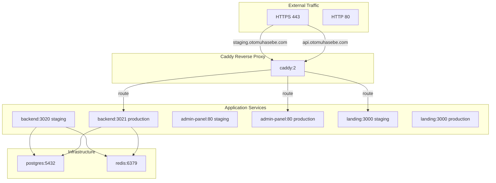

# Docker Deployment Guide - OtoMuhasebe (Caddy + Split Compose + Port-less Model)

## Overview

Bu proje Docker containerization ile tamamen yönetilebilir hale getirilmiştir. Caddy reverse proxy (auto-SSL), split docker-compose yapısı, Makefile, port-siz deployment modeli ve mevcut proje yapısını koruyan profesyonel bir SaaS deployment'dir.

## Mimari

- **Tek Image Yapısı**: Tüm uygulamalar aynı dockerfile kullanıyor, sadece environment (staging/prod) farklı
- **Domain Tabanlı Routing**: Caddy reverse proxy ile domain-based routing
- **Auto-SSL**: Caddy Let's Encrypt ile otomatik SSL sertifikaları
- **Split Compose**: base, staging, prod ayrı dosyalar ile modüler yapı
- **Makefile**: Tüm operasyon komutları tek yerden yönetilebilir
- **Port-less Model**: App container'ları internal portlarda çalışıyor, sadece Caddy 80/443 dış dünyaya açık
- **PM2 yok**: Tamamen Docker tabanlı deployment

## Proje Yapısı

```
/var/www/
├── api-stage/server/          # Backend API (NestJS)
│   └── Dockerfile (updated - parametrik PORT)
├── admin-stage/               # Admin Panel (Vite + React)
│   ├── Dockerfile (updated - parametrik PORT)
│   └── nginx.conf (korunuyor)
├── otomuhasebe-landing/     # Landing Page (Next.js)
│   ├── Dockerfile (updated - parametrik PORT)
│   └── next.config.js (standalone output - zaten var)
├── docker/
│   ├── caddy/
│   │   └── Caddyfile (YENİ - reverse proxy + auto-SSL)
│   └── compose/
│       ├── .env.staging (YENİ - staging env)
│       ├── .env.production (YENİ - prod env)
│       ├── docker-compose.base.yml (YENİ - infra services)
│       ├── docker-compose.staging.yml (YENİ - staging services)
│       └── docker-compose.prod.yml (YENİ - prod services)
├── Makefile (YENİ - operasyon komutları)
├── docker-compose.yml (YENİDEN DÜZENLENDİ - split yapı link)
└── DOCKER_README.md (bu dosya)
```

## Kurulum

### 1. Docker ve Docker Compose Kurulumu

```bash
# Docker kurulumu
curl -fsSL https://get.docker.com -o get-docker.sh
sudo sh get-docker.sh

# Docker Compose kurulumu (plugin)
sudo apt-get install docker-compose-plugin

# Kullanıcıyı docker grubuna ekle
sudo usermod -aG docker $USER
newgrp docker
```

### 2. Environment Dosyalarını Düzenle

Production credentials'ları güncelle:

```bash
# Staging ortamı
nano /var/www/docker/compose/.env.staging

# Production ortamı
nano /var/www/docker/compose/.env.production
```

**Önemli Değişkenler:**
- `POSTGRES_PASSWORD`: PostgreSQL şifresi
- `JWT_SECRET`: JWT token secret key'i
- `REDIS_PASSWORD`: Redis şifresi (opsiyonel)
- `HIZLI_USERNAME`, `HIZLI_PASSWORD`: Hızli Bilişim credentials
- `TIMEZONE`: Timezone (Europe/Istanbul)
- `NODE_MEMORY_MB`: Node.js memory limit (MB)

### 3. DNS Ayarlama

Domain'leri sunucu IP adresine yönlendir:

| Environment | Domain | Hedef Service |
|-------------|--------|----------------|
| Staging | staging.otomuhasebe.com | landing-page:3000 |
| Staging | staging-api.otomuhasebe.com | backend:3020 |
| Staging | admin-staging.otomuhasebe.com | admin-panel:80 |
| Production | otomuhasebe.com, www.otomuhasebe.com | landing-page:3000 |
| Production | api.otomuhasebe.com | backend:3021 |
| Production | admin.otomuhasebe.com | admin-panel:80 |

**Not:** Caddy reverse proxy container'ların 80/443 portlarını dinler, request'leri ilgili servise yönlendirir.

## Kullanım

### Makefile Komutları (Tercih Edilen Yöntem)

Makefile kullanımı çok daha basittir:

```bash
# Staging ortamı
make up-staging          # Build ve start staging (proxy + db + cache)
make build-staging        # Sadece build (start etmez)
make migrate-staging      # Database migration (staging)
make logs-staging        # Tüm staging logları
make down-staging        # Staging'i durdur
make destroy-staging      # Staging'i durdur + volume'ları sil (DANGEROUS!)
make backup-staging      # Staging DB backup
make restore-staging     # Backup'ten geri yükle (DUMP=file.dump)

# Production ortamı
make up-prod            # Build ve start production (proxy + db + cache)
make build-prod          # Sadece build (start etmez)
make migrate-prod        # Database migration (production)
make logs-prod          # Tüm production logları
make down-prod            # Production'u durdur
make destroy-prod        # Production'u durdur + volume'ları sil (DANGEROUS!)
make backup-prod        # Production DB backup

# Utility komutları
make ps                 # Tüm servislerin durumu
make stats              # Docker resource usage (CPU, Memory)
make clean              # Unused Docker kaynaklarını temizle
make clean-all          # TÜM Docker kaynaklarını temizle (DANGEROUS!)
make prune              # Build cache'i temizle
make help               # Yardım göster
```

### Docker Compose Komutları (Direct)

Eğer Makefile kullanmak istemiyorsanız:

```bash
# Staging ortamı
docker compose --env-file docker/compose/.env.staging \\
    -f docker/compose/docker-compose.base.yml \\
    -f docker/compose/docker-compose.staging.yml \\
    --profile proxy,db,cache up -d

# Production ortamı
docker compose --env-file docker/compose/.env.production \\
    -f docker/compose/docker-compose.base.yml \\
    -f docker/compose/docker-compose.prod.yml \\
    --profile proxy,db,cache up -d

# Logları izleme
docker compose --env-file docker/compose/.env.staging -f docker/compose/docker-compose.base.yml -f docker/compose/docker-compose.staging.yml logs -f

# Servisleri durdurma
docker compose --env-file docker/compose/.env.staging -f docker/compose/docker-compose.base.yml -f docker/compose/docker-compose.staging.yml down
```

### Docker Profilleri

Profiller servis gruplarını yönetir:

| Profil | Servisler | Açıklama |
|--------|----------|-----------|
| `proxy` | Caddy reverse proxy | Domain routing ve SSL |
| `db` | PostgreSQL | Database servisi |
| `cache` | Redis | Cache servisi |

Varsayılan olarak `make up-staging` veya `make up-prod` tüm profilleri aktive eder.

Profilleri özelleştirmek için:

```bash
# Sadece backend ve db (Caddy olmadan test)
export PROFILES_STAGING=db
make up-staging

# Sadece Caddy (production test)
export PROFILES_PROD=proxy
make up-prod
```

## Port Mapping

| Environment | Service | Container Port | Host Port | Domain |
|-------------|----------|----------------|-----------|--------|
| Staging | Landing Page | 3000 | 3006 | staging.otomuhasebe.com |
| Staging | API Backend | 3020 | 3020 | staging-api.otomuhasebe.com |
| Staging | Admin Panel | 80 | 3001 | admin-staging.otomuhasebe.com |
| Production | Landing Page | 3000 | 3007 | otomuhasebe.com |
| Production | API Backend | 3021 | 3021 | api.otomuhasebe.com |
| Production | Admin Panel | 80 | 3002 | admin.otomuhasebe.com |

## Deployment Akışı

### 1. İlk Deploy (Staging)

```bash
cd /var/www

# 1. Build ve start
make up-staging

# 2. Logları kontrol et
make logs-staging

# 3. Migration çalıştır (eğer gerekliyse)
make migrate-staging

# 4. Uygulamayı test et
# Browser ile staging.otomuhasebe.com açın
```

### 2. Production Deploy

```bash
cd /var/www

# 1. Production credentials'ları güncelle
nano docker/compose/.env.production

# 2. Production build ve start
make up-prod

# 3. Logları kontrol et
make logs-prod

# 4. Migration çalıştır
make migrate-prod

# 5. Uygulamayı test et
# Browser ile otomuhasebe.com açın
```

## Backup ve Restore

### Automated Backup

```bash
# Staging database backup
make backup-staging

# Production database backup
make backup-prod

# Backup klasörü: /var/www/backups/
# Backup formatı: PostgreSQL custom format (.dump)
```

**Backup içerir:**
1. PostgreSQL database (otomuhasebe_stage / otomuhasebe_prod)
2. Backup'ler `backups/` klasöründe saklanır
3. Dosya adı: `staging_YYYY-MM-DD_HHMM.dump` veya `prod_YYYY-MM-DD_HHMM.dump`

### Restore

```bash
# Staging restore
make restore-staging DUMP=backups/staging_2026-01-17_1200.dump

# Production restore
make restore-prod DUMP=backups/prod_2026-01-17_1200.dump
```

**Önemli:** Restore işlemi mevcut database'in üzerine yazar, veri kaybı olabilir. Restore öncesi backup alın.

## Monitoring

### Servis Durumunu Göster

```bash
# Tüm servislerin durumunu göster
make ps

# Çıktı örneği:
# Staging services:
# NAME                     STATUS    PORTS
# otomuhasebe-backend-staging  running    0.0.0.0:3020->3020/tcp
# otomuhasebe-admin-staging     running    0.0.0.0:3001->80/tcp
# otomuhasebe-landing-staging   running    0.0.0.0:3006->3000/tcp
# otomuhasebe-caddy            running    0.0.0.0:80->80/tcp
# otomuhasebe-postgres        running    
# otomuhasebe-redis             running    
```

### Resource Monitoring

```bash
# CPU, Memory, Network, Disk kullanımı
make stats
# Veya
docker stats
```

### Logları İzleme

```bash
# Tüm staging loglarını izle
make logs-staging

# Tüm production loglarını izle
make logs-prod

# Sadece backend loglarını izle
make log-backend-staging
make log-backend-prod
```

## Troubleshooting

### Container Başlamıyor

```bash
# Logları kontrol et
make logs-staging
# veya
docker compose --env-file docker/compose/.env.staging -f docker/compose/docker-compose.base.yml -f docker/compose/docker-compose.staging.yml logs backend

# Container içine gir
docker exec -it otomuhasebe-backend-staging sh
```

### Port Çakışması

Port çakışması yaşamaz, her ortam farklı host port kullanır:
- Staging: 3020, 3001, 3006
- Production: 3021, 3002, 3007

### Database Bağlantı Sorunu

```bash
# PostgreSQL container'a bağlan
docker exec -it otomuhasebe-postgres psql -U postgres otomuhasebe_stage

# Database bağlantısını test et
docker exec otomuhasebe-postgres pg_isready -U postgres
```

### Caddy SSL Hatası

Caddy SSL sertifikalarını otomatik olarak alır. İlk request'te certificate error alırsanız:

```bash
# Caddy loglarını kontrol et
docker logs otomuhasebe-caddy

# DNS doğru yönlendirildiğinden emin olun
dig staging.otomuhasebe.com
dig api.otomuhasebe.com
```

**Önemli:** Caddy Let's Encrypt ile certificate almak için domain'in public DNS'de sunucuya point olmalıdır.

### Prisma Migration Hatası

```bash
# Manual migration çalıştır
docker compose --env-file docker/compose/.env.staging -f docker/compose/docker-compose.base.yml -f docker/compose/docker-compose.staging.yml exec backend npx prisma migrate dev

# Prisma studio'yu başlat (debug için)
docker compose --env-file docker/compose/.env.staging -f docker/compose/docker-compose.base.yml -f docker/compose/docker-compose.staging.yml exec -it backend npx prisma studio
```

### Disk Doluluğu

```bash
# Docker disk kullanımını kontrol et
docker system df

# Temizlik (durdurulmuş container'ları, kullanılmayan image'ları sil)
make clean

# Tümünü temizle (volume'ları da dahil - DANGEROUS!)
make clean-all
```

## Güvenlik

### Best Practices

1. **Auto-SSL**: Caddy Let's Encrypt ile otomatik SSL sertifikaları sağlar
2. **Environment Variables**: `.env` dosyalarını repository'ye commit etmeyin
3. **Password Gücü**: Production credentials için güçlü şifreler kullanın
4. **Container Privileges**: Non-root user ile çalıştırılır (Dockerfile'larda tanımlı)
5. **Rate Limiting**: Caddy'ye eklenebilir (Caddyfile'de conf)
6. **Backup Rutini**: Günlük backup alınmasını otomatize edin

### Cron Job ile Otomatik Backup

```bash
# Cron job ekle (her gece 02:00'de staging backup)
crontab -e

# Satır ekle:
0 2 * * * cd /var/www && make backup-staging >> /var/log/docker-backup.log 2>&1
```

## Port Değişimi

Portları değiştirmek için `.env.staging` veya `.env.production` dosyasını güncelleyin, docker-compose dosyasını yeniden start edin:

```bash
# Staging için port değişimi (örnek: backend'i 3025 yap)
nano docker/compose/.env.staging
# BACKEND_PORT=3025

# Servisi restart et
make restart-backend-staging
```

## PM2 Kaldırma

Geçiş tamamlandıktan sonra PM2'yi kaldırabilirsiniz:

```bash
# Tüm PM2 process'lerini durdur
pm2 stop all

# PM2'den sil
pm2 delete all

# PM2 save ve flush
pm2 save
pm2 flush

# Global PM2'yi kaldır (opsiyonel)
npm uninstall -g pm2
```

## Support

Sorunlar için logları kontrol edin:

| Servis | Log Komutu |
|--------|-------------|
| Backend Staging | `make log-backend-staging` |
| Backend Prod | `make log-backend-prod` |
| Admin Staging | `make log-admin-staging` |
| Admin Prod | `make log-admin-prod` |
| Landing Staging | `make log-landing-staging` |
| Landing Prod | `make log-landing-prod` |
| PostgreSQL | `docker logs otomuhasebe-postgres` |
| Caddy | `docker logs otomuhasebe-caddy` |

## Quick Reference

```bash
# Staging deploy
make up-staging

# Production deploy
make up-prod

# Logları izle
make logs-staging
make logs-prod

# Servisleri durdur
make down-staging
make down-prod

# Backup
make backup-staging
make backup-prod

# Restore
make restore-staging DUMP=backups/file.dump
make restore-prod DUMP=backups/file.dump

# Yardım
make help
```

## Mimari Diyagramı


