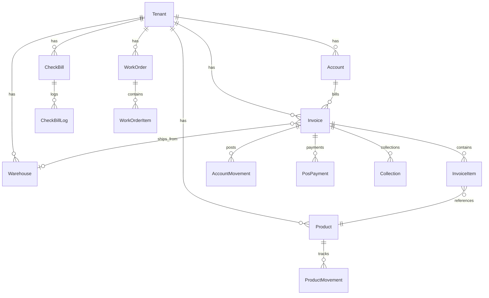

# OtoMuhasebe — Teknik Proje Raporu

| Öğe | Açıklama |
|-----|----------|
| Kapsam | Backend (NestJS), veri modeli (Prisma/PostgreSQL), panel ve B2B istemcileri, güvenlik (RLS), denetim (audit), iş akışları |
| Kaynak | Kod tabanı (`api-stage/server`, `panel-stage/client`, `b2b-portal`) |
| Bölüm sayısı | 16 (mimari, veri, güvenlik, alt-sistemler, sayfa envanteri, enum referansı, AI altyapısı) |

Bu doküman, kod tabanına dayanarak **OtoMuhasebe** projesinin mimarisini, kullanılan teknolojileri, veri modeli yaklaşımını ve önemli iş akışlarını özetler. Amaç; raporu okuyan birinin ürünün **ne olduğunu**, **nasıl parçalandığını** ve **nerede neyin yönetildiğini** tek kaynaktan anlamasıdır.

---

## 1. Ürün Özeti

**OtoMuhasebe**, otomotiv / yedek parça odaklı işletmeler için tasarlanmış **çok kiracılı (multi-tenant) ERP / muhasebe** platformudur. Tipik kapsam:

- **Stok & ürün** (malzeme, barkod, kategori/marka, birim setleri, lokasyon/raf, stok hareketleri)
- **Cari** hesaplar ve **cari hareketler**
- **Satın alma / satış faturaları**, iadeler, e-fatura/e-arşiv
- **Siparişler**, **satış / satın alma irsaliyeleri**, **teklifler**
- **Kasa, banka, tahsilat / ödeme**, çek-senet (portföy, ciro, protesto, onay akışı)
- **POS** modülü (panel tarafında ayrı UI kuralları)
- **Servis** (iş emri, teknisyen, parça talebi, servis faturası, bakım planlaması vb.)
- **B2B**: bayi portalı, çoklu ERP adaptörü ile senkronizasyon kuyrukları, B2B admin paneli
- **İK / bordro**: personel, maaş planları, izin, avans, fazla mesai
- **Raporlama / analitik**: karlılık, satış elemanı performansı, cari risk, vade analizi, yönetim dashboard'u
- **SaaS altyapısı**: plan/abonelik/lisans/kupon, kiracı yaşam döngüsü

Kiracı izolasyonu **uygulama katmanında** (`tenantId`, middleware, servis sorguları) ile birlikte, veritabanında **Row Level Security (RLS)** ile desteklenmektedir. **Denetim günlükleri** (`AuditLog` ve alan-spesifik kayıtlar) ile kritik işlemlerin izlenebilirliği sağlanır.

---

## 2. Depo Yapısı (Monorepo)

| Dizin | Rol |
|--------|-----|
| `api-stage/server/` | NestJS API, Prisma, iş kuralları, kuyruklar |
| `panel-stage/client/` | Ana yönetim paneli (Next.js App Router) |
| `b2b-portal/` | Bayi / B2B portal arayüzü (Next.js) |
| `infra/compose/` | Docker Compose tabanlı geliştirme / staging / prod iskeleti |
| `.cursor/rules/`, `AGENTS.md` | Proje içi AI / geliştirici standartları |

---

## 3. Backend Mimarisi

### 3.1 Çatı

- **Framework**: NestJS **11.x**
- **Dil**: TypeScript **5.9.x**
- **ORM**: Prisma **6.18.x** → **PostgreSQL**
- **API dokümantasyonu**: Swagger (`@nestjs/swagger`)
- **Doğrulama**: `class-validator` + `class-transformer` (`ValidationPipe`)
- **Güvenlik / performans**: `helmet`, `compression`, `@nestjs/throttler`
- **Kimlik**: JWT (`@nestjs/jwt`, `passport-jwt`)
- **Arka plan işler**: BullMQ (`@nestjs/bullmq`) + **Redis**
- **Dosya depolama**: **MinIO** (S3 uyumlu) — `minio` paketi
- **Rapor / çıktı**: `exceljs`, `pdfmake`
- **Zamanlama**: `@nestjs/schedule` (`ScheduleModule`)
- **Harici entegrasyon örnekleri**: `axios`, `mssql`, `strong-soap`, `xml2js` (Logo/Mikro vb. ERP köprüleri ve e-belge akışları için)

### 3.2 Uygulama Girişi ve Çapraz Kesit Yetenekler

`main.ts` içinde:

- **Helmet** ile güvenlik başlıkları
- **Compression**
- **CORS** (ortam değişkeni `CORS_ORIGINS` veya varsayılan localhost/staging listesi)
- **Trust proxy** (rate limit / IP için)
- **Swagger** kurulumu
- Global **exception filter** ve **interceptor** katmanları (`src/common/filters`, `src/common/interceptors`)

### 3.3 `AppModule` ve Modül Kataloğu

`app.module.ts` çok sayıda feature modülünü içe aktarır. Öne çıkanlar:

| Alan | Modül (örnek) | Not |
|------|----------------|-----|
| Kimlik / kullanıcı | `AuthModule`, `UsersModule`, `RolesModule`, `PermissionsModule` | JWT + RBAC |
| Kiracı | `TenantsModule`, `SubscriptionsModule`, `PlansModule`, `PaymentsModule`, `LicensesModule` | SaaS faturalama / lisans |
| Stok | `ProductModule`, `ProductMovementModule`, `StockMoveModule`, `WarehouseModule`, `LocationModule`, `WarehouseTransferModule`, `InventoryCountModule`, `WarehouseCriticalStockModule` | Stok ve depo |
| Finans belgeleri | `InvoiceModule`, `OrderModule`, `SalesWaybillModule`, `PurchaseWaybillModule`, `PurchaseOrdersModule`, `CollectionModule` | Ana ERP dokümanları |
| Cari | `AccountModule`, `AccountMovementModule`, `AccountBalanceModule` | Bakiye / hareket |
| Kasa / banka | `CashboxModule`, `BankModule`, `BankAccountModule`, `BankTransferModule`, `CompanyCreditCardModule` | Nakit ve banka |
| Gider / bordro | `ExpenseModule`, `EmployeeModule`, `SalaryPlanModule`, `AdvanceModule` | İK ve gider |
| Çek-senet | `CheckBillModule` | Portföy, ciro, protesto, onay akışı |
| Fiyatlandırma | `PriceCardModule`, `PriceListModule`, `CostingModule` | Kart / liste / maliyet |
| Rapor | `ReportingModule`, `InvoiceProfitModule`, `DashboardModule`, `AnalyticsModule` | Özet ve analitik |
| Servis | `WorkOrderModule`, `TechniciansModule`, `PartRequestModule`, `ServiceInvoiceModule`, `CustomerVehicleModule`, `VehicleBrandModule` | Servis iş akışı |
| POS | `PosModule` | Perakende |
| B2B | `B2bSyncModule`, `B2bAdminModule`, `B2bPortalModule` | Senkron, admin, portal API |
| Altyapı | `StorageModule`, `QueueModule`, `RlsModule`, `InternalModule`, `AdminModule`, `CodeTemplateModule` | Dosya, kuyruk, iç API, numara şablonları |

> Not: `app.module.ts` içinde bazı modüller yorum satırıyla geçici kapatılmış olabilir. Güncel durum için dosyaya bakılmalıdır.

### 3.4 Ortak Katman (`src/common`)

Tipik içerik:

- **PrismaModule**: veritabanı erişimi (bağlantı havuzu yönetimi dahil)
- **DeletionProtectionModule** + **DeletionProtectionService**: silme iş kuralları ve başarısız silme denemelerinde **`AuditLog`** üretimi
- **TenantMiddleware** + **TenantContextModule** / **TenantResolverService**: istek başına kiracı çözümü
- **JwtAuthGuard**: korumalı rotalar
- **RedisModule**, **QueueModule**: kuyruk ve önbellek
- **B2BPrismaModule**: B2B tarafına özel prisma kullanım desenleri
- **Exception filter**'lar: Prisma ve HTTP hatalarının tek tip cevapları
- **ErpProductLiveMetricsService**: ERP ürün canlı metrikleri

### 3.5 API Tasarım İlkeleri (Kod Standardı)

Projede beklenen kurallar (`.cursor/rules` ve `AGENTS.md` ile uyumlu):

- Çok kiracılı sorgularda **`tenantId`** filtresi
- Silinmiş kayıtlarda **`deletedAt: null`**
- POST/PUT için **DTO + class-validator**
- Swagger ile **endpoint ve model** dokümantasyonu
- Finansal işlemlerde **Prisma `$transaction`** kullanımı

---

## 4. Veri Katmanı (Prisma / PostgreSQL)

### 4.1 Genel

- **Tek şema dosyası**: `api-stage/server/prisma/schema.prisma` (~5500+ satır)
- **Veritabanı**: PostgreSQL (`datasource db`)
- Yaklaşık **170+ Prisma modeli** (büyük ve kapsamlı bir ERP şeması)
- Çoğu iş modelinde:
  - **`tenantId`** (kiracı ayrımı)
  - **`deletedAt`** (soft delete)
  - **`createdAt` / `updatedAt`** ve çoğu yerde **`createdBy` / `updatedBy`**

### 4.2 Çekirdek Varlık: `Tenant`

`Tenant` modeli; faturalar, stok, cari, depolar, siparişler, B2B senkron döngüleri vb. **onlarca ilişki** ile merkezi kiracı kaydıdır. Tüm bu ilişkiler `schema.prisma` içinde `Tenant` üzerinde toplanmıştır.

### 4.3 Örnek İlişki Zinciri: Fatura

`Invoice` modeli (özet):

- **Cari**: `accountId` → `Account`
- **Kalemler**: `items` → `InvoiceItem[]`
- **Depo**: `warehouseId` → `Warehouse?`
- **Satış elemanı**: `salesAgentId` → `SalesAgent?`
- **Kaynak belgeler** (opsiyonel): `SalesDeliveryNote`, `PurchaseDeliveryNote`, `PurchaseOrder`, `ProcurementOrder` üzerinden bağlantılar
- **Tahsilat**: `invoiceCollections`, `collections`, `InvoiceCollection`
- **e-Fatura**: `eInvoiceStatus`, `eInvoiceEttn`, senaryo/tip alanları, `EInvoiceXML`, `EInvoiceSend`
- **Muhasebesel iz**: `accountMovements` → `AccountMovement[]`
- **POS ödemeleri**: `posPayments` → `PosPayment[]`
- **Kiracı**: `tenantId` → `Tenant`

Bu yapı, "belge → kalem → stok hareketi / cari hareketi" izlenebilirliğini destekler.

### 4.4 Stok ve Ürün

- `Product`: ürün ana kartı; fiyat kartları, lokasyon stokları, hareketler ile ilişkili
- `ProductMovement`: stok giriş/çıkış tipleri (`MovementType` enum) — faturalarla bağlantılı kayıtlar
- `Warehouse`, `Location`, `ProductLocationStock`: depo / raf / miktar dağılımı
- `Brand`, `Category`: marka ve kategori sınıflandırması

### 4.5 B2B Tarafı (Özet)

Şemada B2B müşteri, senkron logları, ürün/fiyat eşlemeleri, hesap hareketleri gibi modeller bulunur (ör. `B2BCustomer`, `B2BAccountMovement`, `B2BSyncLog`, `B2BSyncLoop` — tam liste `schema.prisma` içinde).

### 4.6 ER Diyagramı (Özet — Mermaid)

Aşağıdaki diyagram **tam şemayı değil**, okuyucuya ana akışı göstermek için **sadeleştirilmiş** bir kesittir:



Detaylı tüm ilişkiler için **`prisma/schema.prisma`** esas alınmalıdır.

---

## 5. Frontend Mimarisi

### 5.1 Ana Panel (`panel-stage/client`)

- **Framework**: Next.js **16.x** (App Router)
- **UI**: MUI **7.x** + Emotion
- **Tablolar**: MUI X Data Grid **8.x**
- **Veri çekme**: TanStack React Query **5.x**
- **Form**: React Hook Form + Zod (`@hookform/resolvers`)
- **Global durum**: Zustand
- **Bildirim**: notistack, react-hot-toast
- **Tarih**: `date-fns`, MUI X Date Pickers
- **Dışa aktarım**: `xlsx`, `jspdf`, `html2canvas`, `react-to-print`
- **PWA**: `next-pwa`
- **Barkod**: ZXing
- **Grafik**: Recharts
- **Offline/yerel**: Dexie (IndexedDB)
- **Stil yardımcıları**: Tailwind (projede mevcut; POS hariç çoğu ekranda token/MUI ağırlıklı)

**Önemli desenler:**

- İstemci tarafı API çağrıları: `src/lib/axios.ts`
  - Tarayıcıda **`baseURL: /api`** (CORS'u reverse proxy ile çözmek için)
  - **`x-tenant-id`** header (çok kiracılı)
  - JWT **`accessToken`** (localStorage)
- Uygulama rotaları: `src/app/(main)/...` altında modüler klasörler
- Ortak bileşenler: `StandardPage`, `StandardCard`, `DocumentItemTable` (fatura/sipariş/irsaliye kalem tablosu)

### 5.2 B2B Portal (`b2b-portal`)

- Next.js **16.x**, MUI **7.x**, React Query, axios, Zustand, RHF + Zod  
- Ayrı bir giriş deneyimi ve B2B API uçlarına yönelik istemci

---

## 6. Altyapı ve Çalıştırma (Docker)

`infra/compose/docker-compose.base.yml` özetle şu servisleri tanımlar:

| Servis | Amaç |
|--------|------|
| **PostgreSQL 16** | Ana veritabanı |
| **Redis 7** | Kuyruk / önbellek (BullMQ ile uyumlu) |
| **MinIO** | Nesne depolama (S3 API) |
| **Caddy 2** | TLS / reverse proxy (ortama göre) |

> **Güvenlik notu:** Üretimde şifreler ve port yönetimi ortam değişkenleri ve gizli yönetim sistemleri ile yapılmalıdır; bu raporda **gerçek parola veya gizli anahtar** yer almaz.

---

## 7. Teknoloji Envanteri (Paket Bazlı Özet)

### 7.1 Backend (`api-stage/server/package.json`)

| Kategori | Teknoloji |
|----------|-----------|
| Runtime / dil | Node.js, TypeScript |
| API | NestJS 11, Express 5 |
| Veri | Prisma 6, PostgreSQL |
| Kimlik | JWT, Passport |
| Kuyruk / zamanlama | BullMQ, Redis client, @nestjs/schedule |
| Güvenlik | Helmet, Throttler |
| Dosya / export | MinIO, ExcelJS, pdfmake |
| Diğer | Axios, bcrypt, multer, nodemailer, mssql, soap/xml |

### 7.2 Panel (`panel-stage/client/package.json`)

| Kategori | Teknoloji |
|----------|-----------|
| UI | React 19, Next.js 16, MUI 7 |
| Veri | TanStack Query, axios |
| Form | RHF, Zod |
| Tablo / grid | MUI X Data Grid, TanStack Table |
| Grafik | Recharts |
| Durum | Zustand |
| Offline / yerel | Dexie (IndexedDB) |
| Barkod | ZXing |

### 7.3 B2B Portal (`b2b-portal/package.json`)

Next 16, MUI 7, React Query, axios, Zustand, RHF + Zod, notistack.

---

## 8. İş Akışı Detayları ve Önemli Alt-Sistemler

### 8.1 Rol tabanlı erişim kontrolü (RBAC)

**Modeller:** `Role` → `RolePermission` → `Permission` (kiracıya özgü roller, modül+aksiyon bazlı izinler).

| Model | Özellik |
|-------|---------|
| `Role` | `tenantId` bazlı; `isSystemRole` ile varsayılan roller ayrılır. Kullanıcılar `User.roleId` üzerinden bağlanır. `@@unique([tenantId, name])` |
| `Permission` | `module` + `action` çifti (ör. `INVOICE` / `CREATE`). Kiracıdan bağımsız tekil kayıtlar. `@@unique([module, action])` |
| `RolePermission` | Birleştirme tablosu; `@@unique([roleId, permissionId])` |

**Kullanıcı rolleri enum (`UserRole`):** `SUPER_ADMIN`, `TENANT_ADMIN`, `ADMIN`, `USER`, `VIEWER`, `SUPPORT`, `MANAGER`, `TECHNICIAN`, `WORKSHOP_MANAGER`, `RECEPTION`, `SERVICE_MANAGER`, `PROCUREMENT` — servis/atölye senaryolarına uygun geniş bir yelpaze.

**Frontend:** `authorization/roller` ve `authorization/roller/[id]` sayfalarında rol ve izin yönetimi yapılır.

### 8.2 e-Fatura & e-Belge sistemi

Proje, Türkiye'nin e-fatura / e-arşiv akışlarını destekleyen modellere sahiptir:

| Model | Rol |
|-------|-----|
| `EInvoiceTenantConfig` | Kiracının e-fatura durumu (`isEinvoiceUser`, `isEarsivUser`), entegrasyon VKN'si, API kullanıcı/şifre, test modu |
| `EInvoiceSend` | Gönderilen e-fatura: ETTN, senaryo (`TICARIFATURA`, `TEMELFATURA`, `EARSIV` vb.), profil, XML, gönderim durumu, tekrar sayısı, cevap detayları |
| `EInvoiceXML` | Faturaya bağlı XML içerik kaydı (1:1 ilişki) |
| `EInvoiceInbox` | Gelen e-faturalar: gönderici VKN/ünvan, durum (`UNPROCESSED` vb.), eşleştirilmiş fatura, işleyen kullanıcı |

**Fatura üzerindeki e-belge alanları:** `eScenario`, `eInvoiceType`, `gibAlias`, `deliveryMethod`, `eInvoiceStatus` (`PENDING`, `SENT`, `ERROR`, `DRAFT`), `eInvoiceEttn`.

**Frontend:** `/e-invoice/incoming` sayfası gelen e-fatura kutusunu yönetir.

### 8.3 Çek-Senet sistemi

**Ana model:** `CheckBill` — 50+ alana sahip kapsamlı çek/senet kartı:

- **Temel:** tip (`CHECK`/`PROMISSORY`), portföy tipi, tutar, döviz kuru, vade, banka/şube/IBAN bilgileri
- **Durum yönetimi:** `CheckBillStatus` ile tam yaşam döngüsü
- **Risk ve hukuki:** `riskScore`, protesto bilgileri (`isProtested`, `protestedAt`, `protestReason`), yasal takip (`legalFollowupStarted`, `legalFollowupDate`)
- **Muhasebe:** stopaj oranı/tutarı, KDV, muhasebe kaydı (`glEntryId`)
- **Ciro:** `isEndorsed`, `endorsementDate`, `endorsedTo`
- **Mutabakat:** `isReconciled`, `reconciledAt`
- **Denetim:** `createdBy`, `updatedBy`, `approvedBy`, `approvedAt`, `deletedBy`

**Destek modelleri:**

| Model | İşlev |
|-------|-------|
| `CheckBillJournal` / `CheckBillJournalItem` | Portföy yevmiyesi |
| `CheckBillLog` | Durum geçişi logları |
| `CheckBillEndorsement` | Ciro takibi |
| `CheckBillCollection` | Tahsilat/ödeme bağlantıları |
| `CheckBillGlEntry` | Muhasebe kaydı bağlantısı |
| `CheckBillRiskLimit` | Risk limiti takibi |
| `CheckBillReminder` | Vade hatırlatmaları |
| `CheckBillProtestTracking` | Protesto takibi |
| `CheckBillBankSubmission` | Bankaya tevdi |
| `CheckBillDiscounting` | İskonto |
| `CheckBillReconciliation` | Mutabakat |
| `CheckBillApprovalWorkflow` | Onay akışı (adım, atanan kişi, durum, notlar) |

**Durum enum (`CheckBillStatus`):** `IN_PORTFOLIO` → `SENT_TO_BANK` → `COLLECTED`/`PAID` | `ENDORSED`, `RETURNED`, `WITHOUT_COVERAGE`, `IN_BANK_COLLECTION`, `IN_BANK_GUARANTEE`, `PARTIAL_PAID`, `UNPAID`

**Zamanlanmış görev:** `ReminderTaskService` günlük çalışarak vade hatırlatmaları üretir (`@Cron`).

**Frontend:** `/checks` (liste), `/checks/new` (yeni), `/checks/[id]` (detay), `/checks/[id]/receipt` (makbuz), `/checks/[id]/collection` (tahsilat), `/checks/reports` (raporlar), `/payroll` (bordro yevmiye), `/reports/portfolio` (portföy).

### 8.4 POS modülü

- `PosSession`: kasiyer oturumu — `sessionNo`, açılış/kapanış tutarı, kasa bağlantısı (`cashboxId`), oturum durumu (`OPEN`/`CLOSED`)
- `PosPayment`: ödeme kaydı — fatura bağlantılı; `PaymentMethod` enum ile (nakit, kart, hediye kartı vb.), para üstü takibi
- **Frontend:** `/pos` ve `/pos-v2` — kendi dokunmatik UI kuralları; proje standart stillerinden istisna tutulur (`AGENTS.md` - POS İstisnası)

### 8.5 Belge numaralandırma: `CodeTemplate`

Her kiracı, belge tipine göre otomatik numara üretir:

| Alan | Açıklama |
|------|----------|
| `module` | Enum `ModuleType`: `INVOICE_SALES`, `INVOICE_PURCHASE`, `ORDER_SALES`, `ORDER_PURCHASE`, `DELIVERY_NOTE_SALES`, `QUOTE`, `WAREHOUSE`, `CASHBOX`, `PRODUCT`, `CUSTOMER`, `PERSONNEL`, `INVENTORY_COUNT` |
| `prefix` | Ön ek (ör. `SF`) |
| `digitCount` | Sıra numarası hane sayısı (varsayılan 3) |
| `currentValue` | Mevcut sayaç değeri |
| `includeYear` | Yılı dahil et (ör. `SF2026-001`) |

`@@unique([module, tenantId])` — her kiracıda her modül tipi için tek şablon.

**Frontend:** `/settings/number-templates` sayfasında yönetilir.

### 8.6 B2B senkronizasyon mimarisi

| Bileşen | Rol |
|---------|-----|
| `B2bSyncModule` | BullMQ kuyruğu (`b2b-sync`) kaydı |
| `B2bSyncProcessor` (`@Processor`) | Kuyruk işçisi — `WorkerHost` üzerinden; adapter aracılığıyla ERP'den veri çeker |
| **Adapter fabrikası** | `BAdapterFactory` → `OtoMuhasebeErpAdapter`, `LogoErpAdapter`, `MikroErpAdapter` |
| `B2BSyncType` enum | `PRODUCTS`, `PRICES`, `STOCK`, `ACCOUNT_MOVEMENTS`, `FULL` |
| `B2BSyncLoop` / `B2BSyncLog` | Döngü kayıtları ve detay loglar |
| `B2BTenantConfig` | Kiracı bazlı ERP adaptör tipi ve senkron ayarları |
| `B2BCustomer` / `B2BCustomerClass` | B2B müşteri ve sınıf tanımları |
| `B2BProduct` | B2B ürün eşlemesi (ERP ürün kodu ↔ B2B ürün) |

**Adaptör deseni (Strategy pattern):** `IErpAdapter` arayüzünden türeyen adaptörler — farklı ERP entegrasyonlarında (OtoMuhasebe, Logo, Mikro) aynı senkron mantığını kullanır.

**Frontend:** `/b2b-admin/sync-loops` (senkron döngü izleme), `/b2b-admin/sync` (anlık tetikleme), `/b2b-admin/products`, `/b2b-admin/customers`, `/b2b-admin/orders`, `/b2b-admin/settings`.

### 8.7 Event-Driven mimari & Outbox Pattern

Projede **Transactional Outbox** deseni kullanılmaktadır:

| Bileşen | Açıklama |
|---------|----------|
| `OutboxRelayService` | `@Cron(EVERY_5_SECONDS)` — `outbox_events` tablosundaki `PENDING` olayları BullMQ kuyruğuna aktarır. Max 100 olay/batch, 5 deneme limiti, concurrent execution koruması |
| `EventsModule` | Kuyruk tanımları: `work-order-events`, `accounting-events`, `dead-letter-queue` |
| `DlqWorker` | Max denemeyi aşan başarısız job'ları Dead Letter Queue'da işleyen işçi |
| Retry stratejisi | Exponential backoff: 2s → 4s → 8s → 16s → 32s (5 deneme) |
| Temizlik politikası | Tamamlanan job'lar: 500 adet veya 7 gün saklanır; başarısız job'lar analiz için korunur |

**Ek BullMQ kuyrukları:**

| Kuyruk | Kullanım |
|--------|----------|
| `b2b-sync` | B2B senkronizasyon işleri |
| `invoice-effects` | Fatura sonrası yan etki işlemleri (stok, cari hareket vb.) |
| `notifications` | Bildirim gönderimi |

> **Tasarım kararı:** Outbox servis **RLS dışında** (cross-tenant) çalışır; bu beklenen bir davranıştır ve kod yorumlarında açıkça belirtilmiştir.

### 8.8 Zamanlanmış görevler

`@nestjs/schedule` (`ScheduleModule.forRoot()`) ile:

| Servis | Frekans | İşlev |
|--------|---------|-------|
| `OutboxRelayService` | 5 saniye | Outbox → BullMQ aktarımı |
| `ReminderTaskService` | Günlük 09:00 | Çek/senet vade hatırlatması oluşturma |
| `ReminderTaskService` | Günlük 01:00 | Bakım / temizlik görevi |

### 8.9 Depo ve envanter yönetimi

| Model | İşlev |
|-------|-------|
| `Warehouse` | Depo tanımı (kiracıya bağlı) |
| `Location` | Depo içi raf/lokasyon |
| `ProductLocationStock` | Ürün × lokasyon bazlı stok miktarı |
| `WarehouseTransfer` / `WarehouseTransferItem` / `WarehouseTransferLog` | Depolar arası transfer belgeleri ve logları |
| `InventoryTransaction` | Envanter hareketleri |
| `Stocktake` / `StocktakeItem` | Sayım belgeleri ve kalemleri |

**Frontend:** `/warehouse/warehouses` (liste/detay), `/warehouse/transfer-note` (transferler), `/warehouse/stock-report`, `/warehouse/reports`, `/warehouse/operations/put-away` (raf bazlı yerleştirme), `/warehouse/operations/transfer`, `/inventory-count` (sayım — liste/raf bazlı/ürün bazlı).

### 8.10 Servis / atölye modülü

Otomotiv servis işletmeleri için tasarlanmış kapsamlı bir modül:

| Model | İşlev |
|-------|-------|
| `WorkOrder` → `WorkOrderItem` | İş emri ve kalemleri (işçilik/parça) |
| `WorkOrderActivity` | İş emri denetim kaydı (alan-spesifik audit trail) |
| `PartRequest` | Parça talebi |
| `CustomerVehicle` | Müşteri araç kaydı (plaka, şasi, model, kilometre) |
| `ServiceInvoice` | Servis faturası (iş emri bağlantılı) |
| `VehicleCatalog` | Araç kataloğu (marka/model/motor/yakıt) |
| `MaintenancePlan` / `MaintenanceSchedule` | Bakım planlaması (periyodik servis) |

**Durum akışı (`WorkOrderStatus`):**
`PENDING_APPROVAL` → `APPROVED_IN_PROGRESS` → `PART_WAITING` → `PARTS_SUPPLIED` → `VEHICLE_READY` → `INVOICED_CLOSED` | `CLOSED_WITHOUT_INVOICE` | `CANCELLED`

**Frontend:** `/service/work-orders` (liste/yeni/detay), `/service/technicians`, `/service/part-requests`, `/service/part-procurement`, `/service/invoices`, `/service/customer-vehicles`, `/service/accounting-records`, `/service/reports`.

### 8.11 SaaS faturalama & kiracı yaşam döngüsü

| Model | İşlev |
|-------|-------|
| `Plan` | SaaS planları (modül/kısıtlama tanımları) |
| `Subscription` | Kiracı abonelikleri (başlangıç/bitiş, durum) |
| `License` | Lisans kayıtları |
| `Coupon` / `CouponUsage` | İndirim kuponları ve kullanım takibi |
| `TenantPurgeAudit` | Silinmiş kiracı verilerinin izi |

**Kiracı yaşam döngüsü (`TenantStatus`):**
`PENDING` → `TRIAL` → `ACTIVE` → `SUSPENDED` / `EXPIRED` → `CANCELLED` / `CHURNED` → `PURGED` / `DELETED`

### 8.12 İK / bordro modülü

| Model | İşlev |
|-------|-------|
| `Employee` | Personel kartı |
| `EmployeePayment` | Maaş ödemeleri |
| `SalaryPlan` | Maaş planları |
| `LeaveRequest` | İzin talepleri (durum: `PENDING`, `APPROVED`, `REJECTED`, `CANCELLED`) |
| `OverTime` | Fazla mesai kayıtları |
| `Advance` | Avans kayıtları |

**Frontend:** `/hr/personel`, `/hr/salary-management`, `/hr/advances`, `/payroll`.

### 8.13 Tahsilat / ödeme & kasa / banka

| Model | İşlev |
|-------|-------|
| `Collection` | Tahsilat/ödeme kayıtları (`CollectionType`: `COLLECTION`/`PAYMENT`) |
| `Cashbox` / `CashboxMovement` | Kasa tanımları ve hareketleri |
| `Bank` / `BankAccount` / `BankMovement` | Banka, hesap ve hareketleri |
| `BankTransfer` | Havale/EFT kayıtları |
| `InvoiceCollection` | Fatura-tahsilat eşleştirmesi |

**İş kuralı:** FIFO (First-In, First-Out) ile borç/alacak eşleştirmesi; ağırlıklı ortalama maliyet ile stok maliyeti hesaplanır (`.cursor/rules/erp-core-logic.mdc`).

**Frontend:** `/cash` (kasa), `/bank` (banka), `/collection` (tahsilat), `/payments` (ödeme), `/bank-transfer/gelen|giden|silinen`, `/bank/credit-operations`.

### 8.14 Teklif modülü

- `Quote` → `QuoteItem` → `QuoteLog`
- Satış ve satın alma teklifi akışı
- **Frontend:** `/quotes/sales` ve `/quotes/purchase` (liste/yeni/düzenle/yazdır)

### 8.15 Gider modülü

- `ExpenseCategory`, `Expense`: gider kategorisi ve kayıtları
- **Frontend:** `/expense` (liste/detay)

### 8.16 Fiyatlandırma sistemi

| Model | İşlev |
|-------|-------|
| `PriceCard` | Ürün bazlı fiyat kartı (alış/satış/döviz) |
| `PriceList` / `PriceListItem` | Fiyat listeleri ve kalemleri |
| `UnitSet` | Birim set tanımları (ör. kutu → adet dönüşümü) |

**Frontend:** `/stock/price-cards`, `/stock/sales-prices`, `/stock/purchase-prices`, `/stock/bulk-sales-price-update`, `/stock/costing`.

### 8.17 Veri aktarımı (import)

Panel'de dört ayrı Excel/CSV aktarım sayfası:

| Sayfa | İşlev |
|-------|-------|
| `data-import/cari-hesap-aktarim` | Cari hesap aktarımı |
| `data-import/malzeme-aktarim` | Malzeme / ürün aktarımı |
| `data-import/satis-fiyat-aktarim` | Satış fiyatı aktarımı |
| `data-import/satin-alma-fiyat-aktarim` | Satın alma fiyatı aktarımı |

### 8.18 Raporlama & analitik

| Modül | Kapsamı |
|-------|---------|
| `ReportingModule` | Genel raporlar |
| `InvoiceProfitModule` | Fatura karlılık analizi |
| `DashboardModule` | Yönetim dashboard'u |
| `AnalyticsModule` | İleri analitik |

**Frontend:** `/reporting` (genel), `/reporting/satis-elemani` (satış elemanı performansı), `/reporting/cari-risk-limitleri` (risk), `/management/dashboard`, `/invoice/profitability`, `/reports/portfolio`, `/maturity-analysis` (vade analizi).

### 8.19 Veritabanı bağlantı havuzu stratejisi

`PrismaService` constructor'ında `DATABASE_URL`'e `connection_limit=10&pool_timeout=20&connect_timeout=10` eklenir (yoksa otomatik). Aşırı bağlantı sayısını önleme amacıyla tasarlanmıştır.

---

## 9. Panel (Frontend) sayfa envanteri

Panel'de **171+ sayfa** (`page.tsx`) bulunmaktadır. Ana modüller:

| Modül grubu | Sayfa örnekleri | Sayfa sayısı |
|-------------|-----------------|:------------:|
| Fatura (satış/alış/iade) | Liste, yeni, düzenle, yazdır, karlılık, arşiv, malzeme hazırlama | ~18 |
| Sipariş (satış/alış) | Liste, yeni, düzenle, yazdır, hazırlama | ~12 |
| İrsaliye (satış/alış) | Liste, yeni, düzenle, yazdır, detay | ~10 |
| Teklif (satış/alış) | Liste, yeni, düzenle, yazdır | ~8 |
| Stok & ürün | Malzeme listesi, fiyat kartları, birim set, marka/kategori, hareketler, maliyet, toplu güncelleme, eşleştirme, ambar toplamları, kritik stok | ~14 |
| Cari | Liste, detay, borç-alacak, fatura kapama | 4 |
| Kasa / banka | Kasa, banka, hesap detay, kredi işlemleri, transferler | ~10 |
| Tahsilat / ödeme | Tahsilat, ödeme, yazdır | ~5 |
| Çek-senet / bordro | Liste, yeni, detay, makbuz, raporlar, portföy, bordro | ~8 |
| Depo | Depolar, stok rapor, transfer notları, raf bazlı yerleştirme, raporlar | ~9 |
| Envanter sayım | Sayım, raf bazlı, ürün bazlı, liste | 4 |
| İK / bordro | Personel, maaş yönetimi, avanslar, bordro | 4 |
| Gider | Liste, detay | 2 |
| Servis / atölye | İş emirleri, teknisyenler, parça talep/tedarik, servis faturaları, müşteri araçları, muhasebe, raporlar | ~14 |
| POS | POS v1, POS v2 | 2 |
| B2B Admin | Dashboard, müşteriler, ürünler, siparişler, senkron, iskonto, müşteri sınıfları, satış personeli, ayarlar, raporlar, duyurular, teslimat | ~18 |
| Yetkilendirme | Genel, roller, rol detay | 3 |
| Raporlama | Satış elemanı, cari risk, genel, vade, yönetim dashboard | ~6 |
| Ayarlar | Numara şablonları, parametreler, firma bilgileri, hızlı menü, satış elemanları | 5 |
| E-fatura | Gelen e-fatura | 1 |
| Veri aktarımı | Cari, malzeme, satış fiyat, alış fiyat | 4 |
| Araçlar | Şirket araçları, müşteri araçları | 2 |
| Diğer | Menü, sipariş hazırlama listesi, vb. | ~5 |

---

## 10. Enum referansı (öne çıkanlar)

| Enum | Değerler |
|------|----------|
| `InvoiceType` | `PURCHASE`, `SALE`, `SALES_RETURN`, `PURCHASE_RETURN` |
| `InvoiceStatus` | `DRAFT`, `PENDING`, `OPEN`, `CLOSED`, `PARTIALLY_PAID`, `APPROVED`, `CANCELLED` |
| `MovementType` | `ENTRY`, `EXIT`, `SALE`, `RETURN`, `CANCELLATION_ENTRY`, `CANCELLATION_EXIT`, `COUNT`, `COUNT_SURPLUS`, `COUNT_SHORTAGE` |
| `PaymentMethod` | `CASH`, `CREDIT_CARD`, `BANK_TRANSFER`, `CHECK`, `PROMISSORY_NOTE`, `GIFT_CARD`, `LOAN_ACCOUNT` |
| `CheckBillType` | `CHECK`, `PROMISSORY` |
| `CheckBillStatus` | `IN_PORTFOLIO`, `UNPAID`, `SENT_TO_BANK`, `COLLECTED`, `PAID`, `ENDORSED`, `RETURNED`, `WITHOUT_COVERAGE`, `IN_BANK_COLLECTION`, `IN_BANK_GUARANTEE`, `PARTIAL_PAID` |
| `WorkOrderStatus` | `PENDING_APPROVAL`, `APPROVED_IN_PROGRESS`, `PART_WAITING`, `PARTS_SUPPLIED`, `VEHICLE_READY`, `INVOICED_CLOSED`, `CLOSED_WITHOUT_INVOICE`, `CANCELLED` |
| `B2BSyncType` | `PRODUCTS`, `PRICES`, `STOCK`, `ACCOUNT_MOVEMENTS`, `FULL` |
| `TenantStatus` | `TRIAL`, `ACTIVE`, `SUSPENDED`, `CANCELLED`, `PURGED`, `EXPIRED`, `CHURNED`, `DELETED`, `PENDING` |
| `UserRole` | `SUPER_ADMIN`, `TENANT_ADMIN`, `ADMIN`, `USER`, `VIEWER`, `SUPPORT`, `MANAGER`, `TECHNICIAN`, `WORKSHOP_MANAGER`, `RECEPTION`, `SERVICE_MANAGER`, `PROCUREMENT` |
| `ModuleType` | `WAREHOUSE`, `CASHBOX`, `PRODUCT`, `CUSTOMER`, `INVOICE_SALES`, `INVOICE_PURCHASE`, `ORDER_SALES`, `ORDER_PURCHASE`, `QUOTE`, `DELIVERY_NOTE_SALES`, `PERSONNEL`, `INVENTORY_COUNT` |
| `EInvoiceScenario` | `TICARIFATURA`, `TEMELFATURA`, `EARSIV` vb. |
| `EInvoiceStatus` | `PENDING`, `SENT`, `ERROR`, `DRAFT` |
| `PosSessionStatus` | `OPEN`, `CLOSED` |
| `CollectionType` | `COLLECTION`, `PAYMENT` |
| `OrderType` | `SALE`, `PURCHASE` |
| `LeaveStatus` | `PENDING`, `APPROVED`, `REJECTED`, `CANCELLED` |
| `AccountType` | Cari hesap türleri (şema dosyasında detaylı) |
| `PortfolioType` | Çek/senet portföy türleri |

---

## 11. Şema evrimi (Phase yapısı)

Prisma şeması, geliştirme sırasında aşamalı olarak genişletilmiştir:

| Phase | Kapsam | Öne çıkan modeller |
|-------|--------|---------------------|
| **Çekirdek** | Temel ERP | `Tenant`, `User`, `Product`, `Invoice`, `Account`, `Cashbox`, `Bank`, `Collection`, `Warehouse`, `AccountMovement`, `ProductMovement`, `CheckBill` |
| **Phase 5** | SaaS altyapı | `Coupon`, `CouponUsage`, `Plan`, `Subscription`, `License` |
| **Phase 6** | e-Fatura | `EInvoiceSend`, `EInvoiceTenantConfig`, `EInvoiceScenario` enum |
| **Phase 7** | İK modülü | `LeaveRequest`, `SalaryPlan`, `SalaryPayment`, `OverTime`, `Advance` |
| **Phase 8** | Servis geliştirmeleri | `MaintenancePlan`, `MaintenanceSchedule`, bakım türleri, araç enum'ları |
| **B2B** | B2B ekosistemi | `B2BTenantConfig`, `B2BSyncLoop`, `B2BProduct`, `B2BCustomer`, `B2BCustomerClass`, `B2BAccountMovement` |

---

## 12. Test ve kalite güvencesi

### 12.1 Test araçları

| Araç | Kapsam |
|------|--------|
| **Jest** | Backend birim ve entegrasyon testleri (`npm test`, `test:cov`) |
| **ESLint + Prettier** | Backend kod kalitesi ve biçimlendirme |
| **Next lint** | Panel (frontend) lint |

### 12.2 Test stratejisi (proje kuralları)

Proje kurallarında (`.cursor/rules/testing-strategy.mdc`) aşağıdaki prensipler tanımlanmıştır:

| Prensip | Açıklama |
|---------|----------|
| **Birim test** | `jest-mock-extended` ile Prisma mock'lama; gerçek DB'ye dokunmama |
| **Entegrasyon test** | Docker PostgreSQL ile ayrı test veritabanı |
| **E2E** | Supertest (API), Playwright (frontend) |
| **ERP doğrulama** | `AccountMovement` ve `ProductMovement` kayıtlarının doğruluğu; soft-delete filtreleri |
| **TDD** | Red → Green → Refactor akışı |

---

## 13. Güvenlik, çok kiracılılık ve Row Level Security (RLS)

Bu bölüm, projede **katmanlı güvenlik** ve özellikle **PostgreSQL RLS** ile **uygulama içi tenant bağlamının** nasıl birleştirildiğini özetler.

### 13.1 Savunma katmanları (özet)

| Katman | Mekanizma | Amaç |
|--------|-----------|------|
| Uygulama | JWT (`JwtAuthGuard`), RBAC (`Role`/`Permission`) | Kimlik ve yetkilendirme |
| İstek bağlamı | `TenantMiddleware`, `TenantContextService`, `TenantResolverService`, CLS (`ClsService`) | İstek başına doğru `tenantId` / kullanıcı bağlamı |
| İstemci | `x-tenant-id` header (panel `axios` interceptor) | Çok kiracılı API çağrılarında kiracı seçimi |
| Veri erişimi | Prisma sorgularında `tenantId` + `deletedAt: null` (standart) | Mantıksal izolasyon ve soft delete |
| Ağ / HTTP | Helmet, CORS, Throttler, compression | Sertleştirme, kötüye kullanım sınırlama |
| Veritabanı | **RLS** politikaları + session parametresi `app.current_tenant_id` | Sunucu tarafında satır bazlı ek koruma |

> **Önemli:** RLS, uygulama katmanındaki filtrelerin yerine geçmez; **defense in depth** (çok katmanlı savunma) olarak düşünülmelidir. Uygulama hatalarında bile yanlış kiracı verisinin dönmesini zorlaştırır.

### 13.2 PostgreSQL RLS ve Prisma entegrasyonu

**Teknik desen:** Her Prisma işlemi öncesinde, genişletilmiş (`extended`) istemci üzerinden PostgreSQL'e şu çağrı yapılır:

```sql
SELECT set_config('app.current_tenant_id', '<tenantId>', false);
```

**Kaynak:** `api-stage/server/src/common/prisma.service.ts` — `get extended()` içinde `$extends` + `$allModels` / `$allOperations` hook'u.

**Bağlam kaynağı:** `ClsService.getTenantId()` — istek yaşam döngüsü boyunca tutulan kiracı kimliği.

**Davranış:**

- `tenantId` **yoksa**: konsola uyarı loglanır; RLS politikaları sorguları **engelleyebilir** (tasarım amacına uygun).
- `tenantId` **varsa**: session parametresi set edilir; tablolardaki RLS politikaları `current_setting('app.current_tenant_id', true)` benzeri ifadelerle **kiracıya göre satır filtreler**.

**Not (`set_config` üçüncü argümanı):** Kodda `false` kullanımı, değerin **transaction sonrası da session boyunca** kalmasına izin verir; Prisma'nın her sorguyu ayrı transaction'da çalıştırma eğilimiyle uyumluluk için tercih edilmiştir.

### 13.3 `RlsModule` — doğrulama ve gözlemlenebilirlik uçları

**Konum:** `api-stage/server/src/modules/rls/` — `RlsController` (`@Controller('rls')`).

| Endpoint (özet) | Amaç |
|-----------------|------|
| `GET /rls/test` | Tenant bağlamı + Prisma `count` vs. ham SQL ile sayım karşılaştırması (RLS tutarlılık kontrolü) |
| `GET /rls/status` | `pg_tables.rowsecurity` ve `pg_policies` üzerinden RLS etkin tablo ve `*_tenant_isolation` politika sayıları |
| `POST /rls/test-transaction` | Transaction içinde ürün listesi / sayım — RLS'nin transaction akışında davranışını test etmek için |

### 13.4 RLS ile ilgili operasyonel notlar

- **Migration takibi:** RLS politikaları SQL migration'larla yönetilir; `rls.controller` içinde `*_tenant_isolation` adlandırmasıyla sayım yapılır
- **Bypass riski:** Doğrudan `PrismaService` (extended olmayan) veya ham SQL ile tenant set edilmeden yapılan sorgular RLS'yi atlayabilir
- **Süper admin / bakım işleri:** Kiracı dışı işlemler için ayrı bağlantı rolü veya güvenli internal pipeline tanımlanması önerilir
- **Outbox istisnası:** `OutboxRelayService` tasarım gereği cross-tenant çalışır; kod içi yorum ile belgelenmiştir

---

## 14. Denetim günlükleri (Audit trail) ve izlenebilirlik

Projede "kim ne yaptı?" sorusu **merkezi bir tablo** ve **alan-spesifik** kayıtlarla desteklenir.

### 14.1 Merkezi `AuditLog` modeli

**Şema:** `AuditLog` → tablo eşlemesi `audit_logs` (`schema.prisma`).

| Alan | Rol |
|------|-----|
| `tenantId` | Kiracı — tüm kayıtlar kiracıya bağlı |
| `userId` | İşlemi yapan kullanıcı (opsiyonel) |
| `action` | Olay tipi (serbest string; örn. `DELETE_BLOCKED`) |
| `resource` / `resourceId` | Mantıksal varlık adı ve kimlik |
| `meta` (JSON) | Ek bağlam (ör. engelleme nedeni) |
| `ipAddress`, `userAgent` | İstemci izi (doldurulduğunda) |
| `createdAt` | Zaman damgası |

İndeksler: `userId`, `tenantId`, `action`, `createdAt` — listeleme ve filtreleme için.

### 14.2 Silme koruması ve `DELETE_BLOCKED` kayıtları

**Servis:** `DeletionProtectionService` (`api-stage/server/src/common/services/deletion-protection.service.ts`).

Aşağıdaki silme denemeleri iş kurallarına takıldığında **`BadRequestException`** fırlatılır ve paralelde **`auditLog.create`** ile kayıt düşülür:

- **Cari:** cari hareketi, fatura, tahsilat/ödeme varsa silme engeli  
- **Ürün (stok kartı):** stok hareketi, fatura kalemi, depo hareketi varsa silme engeli  
- **Fatura:** onaylı (`APPROVED`) fatura veya faturaya bağlı tahsilat varsa silme engeli  

`action: 'DELETE_BLOCKED'`, `meta: { reason }` ile **neden** izlenebilir.

### 14.3 Yönetici API: `/admin/logs`

**Controller:** `AdminLogsController` — `GET /admin/logs`, `GET /admin/logs/stats` (`JwtAuthGuard` ile korumalı).

- Sayfalı liste: `action`, `userId`, `resource`, tarih aralığı filtreleri  
- İstatistik: toplam, son 24 saat, aksiyon bazlı `groupBy`  

### 14.4 Alan-spesifik denetim kayıtları

| Mekanizma | Kapsam |
|-----------|--------|
| `WorkOrderActivity` | İş emri akışında durum değişimi, işçilik/parça ekleme, faturalama logları. `WorkOrderService.createAuditLog` ile yazılır. |
| `CheckBillLog` | Çek/senet durum geçişi logları |
| `SalesOrderLog` / `PurchaseOrderLocalLog` | Sipariş durum logları |
| `SalesDeliveryNoteLog` / `PurchaseDeliveryNoteLog` | İrsaliye durum logları |
| `QuoteLog` | Teklif durum logları |
| `WarehouseTransferLog` | Depo transfer logları |

Bu ayrım, **ERP genel olayları** ile **domain'e özgü timeline**'ları birbirinden düzenli tutar.

### 14.5 Kiracı veri temizliği: `TenantPurgeAudit`

Manuel veya yönetimsel **tenant purge** işlemlerinde: admin kimliği, e-posta, IP, silinen dosya sayısı, hatalar (`errors` JSON) ve zaman damgası saklanır. `TenantPurgeService.getPurgeAuditLog` ile listelenebilir.

### 14.6 Denetim stratejisi önerisi (ileri seviye)

Mevcut yapı üzerine üretimde sık kullanılan eklemeler:

- HTTP **interceptor** ile kritik mutasyonlarda `AuditLog` üretmek (CREATE/UPDATE/DELETE)  
- `userId` / `ipAddress` / `userAgent` alanlarının **tutarlı doldurulması**  
- Log **saklama süresi** ve arşivleme politikası (partition / cold storage)  
- PII maskeleme kuralları (özellikle `meta` JSON içinde)

---

## 15. AI Destekli Geliştirme Altyapısı

Projede geliştirici ve AI arasındaki iş birliğini standartlaştıran kapsamlı bir kural sistemi bulunur:

### 15.1 Cursor Rules (`.cursor/rules/`)

| Kural dosyası | Kapsam |
|---------------|--------|
| `api-design.mdc` | REST standartları, DTO doğrulama, tenant izolasyonu |
| `database-expert.mdc` | Prisma şema tasarımı, query pattern'ler, migration |
| `typescript-style.mdc` | TypeScript/React kodlama stili |
| `security-audit.mdc` | Güvenlik denetim kuralları |
| `performance-vitals.mdc` | Performans ve ölçeklenebilirlik |
| `erp-core-logic.mdc` | ERP iş kuralları (FIFO, stok maliyet, fatura iptal) |
| `ui-premium-design.mdc` | UI/UX tasarım standartları |
| `testing-strategy.mdc` | Test stratejisi |
| `error-diagnostics.mdc` | Hata teşhis protokolü |
| `git-agent-workflow.mdc` | Git/commit standartları |
| `research-first.mdc` | Araştırma-önce geliştirme |
| `architecture-decisions.mdc` | ADR (Architecture Decision Records) formatı |

### 15.2 AI Agent Skills (`AGENTS.md`)

Proje, 16 farklı uzmanlık alanında AI alt-ajan rolleri tanımlar:

| Rol | Uzmanlık |
|-----|----------|
| Frontend Design | MUI v7, modern tasarım |
| Senior Backend | NestJS, Prisma, BullMQ |
| Senior Frontend | Next.js App Router, SSR/CSR |
| Senior Architect | Sistem tasarımı, veritabanı |
| Code Reviewer | Tenant güvenliği, iş kuralları |
| Bug Hunter | Karmaşık hata teşhisi |
| Financial Auditor | ERP hesap kontrolü |
| Inventory Specialist | Stok bütünlüğü |
| Ui UX Pro Max | "Wow" faktörü ve mikro-animasyonlar |
| Learning Memory | Proje tarihçesi ve gotcha takibi |
| Research Expert | Kapsamlı bilgi toplama |
| Git Commit Helper | Semantik commit mesajları |

### 15.3 UI/UX standartları (`AGENTS.md` içinde)

- Renk tokenları zorunluluğu (hard-coded hex yasağı)
- Responsive tasarım kuralları (xs/sm dahil)
- DataGrid V1 (kompakt, `rowHeight: 44px`) ve V2 (finansal belge, `height: 650px`) standartları
- Popup/modal kuralları (minimal header, scroll-free tasarım, `var(--card)` token tabanlı yüzey)
- Tablo ekleme kontrol listesi (arama, filtre, pagination, KPI, export, footer sum)
- `renderCell` tek satır kuralı (`flexDirection: 'column'` yasağı)

---

## 16. Sonuç

**OtoMuhasebe**; yaklaşık **170+ Prisma modeli** ve onlarca **NestJS modülü** ile desteklenen, **çok kiracılı ERP** backend'i ve **171+ sayfadan** oluşan **Next.js + MUI** tabanlı **panel + B2B portal** ön yüzlerinden oluşan kapsamlı bir platformdur.

**Öne çıkan mimari özellikler:**

- **Katmanlı güvenlik:** JWT + RBAC + RLS + Tenant Context (defense in depth)
- **Event-Driven mimari:** Transactional Outbox + BullMQ + DLQ + exponential backoff
- **ERP bütünlüğü:** Fatura → stok hareketi → cari hareket zinciri, FIFO eşleştirme, çift kayıt muhasebesi
- **B2B ekosistemi:** Adapter tabanlı çoklu ERP entegrasyonu (Logo, Mikro, OtoMuhasebe)
- **e-Belge uyumluluğu:** e-Fatura, e-Arşiv, gelen/giden takibi, ETTN yönetimi
- **Çek-senet:** 12+ destek modeli ile tam portföy yönetimi (ciro, protesto, onay akışı, mutabakat)
- **Servis modülü:** Otomotiv servis iş emri akışı, parça talebi, bakım planlaması
- **SaaS altyapısı:** Plan/abonelik/lisans/kupon, kiracı yaşam döngüsü yönetimi
- **Denetim:** Merkezi AuditLog + 6 alan-spesifik log tablosu + silme koruması
- **AI geliştirme:** 12 Cursor kural dosyası + 16 AI agent rolü + detaylı UI/UX standardı

**Derinlemesine inceleme için önerilen dosyalar:**

| # | Dosya | İçerik |
|---|-------|--------|
| 1 | `api-stage/server/prisma/schema.prisma` | Tüm tablo ve ilişkiler (~5500+ satır) |
| 2 | `api-stage/server/src/app.module.ts` | Modül envanteri |
| 3 | `api-stage/server/src/main.ts` | Global middleware ve Swagger |
| 4 | `api-stage/server/src/common/prisma.service.ts` | RLS için `extended` Prisma client |
| 5 | `api-stage/server/src/modules/rls/rls.controller.ts` | RLS test ve durum uçları |
| 6 | `api-stage/server/src/common/services/deletion-protection.service.ts` | Silme koruması + AuditLog |
| 7 | `api-stage/server/src/modules/admin/admin-logs.controller.ts` | Merkezi audit API |
| 8 | `api-stage/server/src/common/events/outbox-relay.service.ts` | Transactional Outbox implementasyonu |
| 9 | `api-stage/server/src/common/events/events.module.ts` | Event queue tanımları + DLQ |
| 10 | `api-stage/server/src/modules/b2b-sync/b2b-sync.processor.ts` | B2B senkron işçisi |
| 11 | `api-stage/server/src/modules/check-bill/reminder-task.service.ts` | Zamanlanmış görevler |
| 12 | `panel-stage/client/src/lib/axios.ts` | İstemci-kiracı-kimlik akışı |
| 13 | `AGENTS.md` ve `.cursor/rules/*` | Ekip/AI için kodlama sözleşmesi |

---

*Bu rapor, belirtilen kod sürümüne göre hazırlanmıştır. RLS politika sayıları, modül açık/kapalı durumları ve şema evrimi için her zaman repodaki güncel dosyalar ve hedef veritabanı şeması esas alınmalıdır.*
